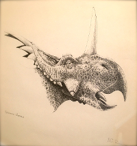

# dipPI

_Styracosaurus albertensis_
Photo Copyright © 2017 seb231
Drawing Copyright © 2017 [James Robbins](http://www.jr-illustration.co.uk/)

## About

A Clojure library for calling the Natural History Museum's Data Portal API:

http://data.nhm.ac.uk/about/download

DOI: 10.5519

## Usage

(At the moment) start a REPL and run either `query-nhm-api` or `filter-nhm-api` with a database name and the following:

"Query" search expects a name of a [database](http://data.nhm.ac.uk/dataset?author=Natural+History+Museum) and a query string i.e "Archaeopteryx".

"Filter" search expects a name of a [database](http://data.nhm.ac.uk/dataset?author=Natural+History+Museum) and a filter field and search string i.e "catalogNumber" and "PV P 51007"

## TODO

1. Read [CKAN API guide](http://docs.ckan.org/en/latest/api/index.html) to work out what functionality I need to bring in.

2. Interrogate some collection results to see what further "get" functions would be beneficial

3. Build uberjar with -main multifunctionality

## License

Copyright © 2017 seb231
